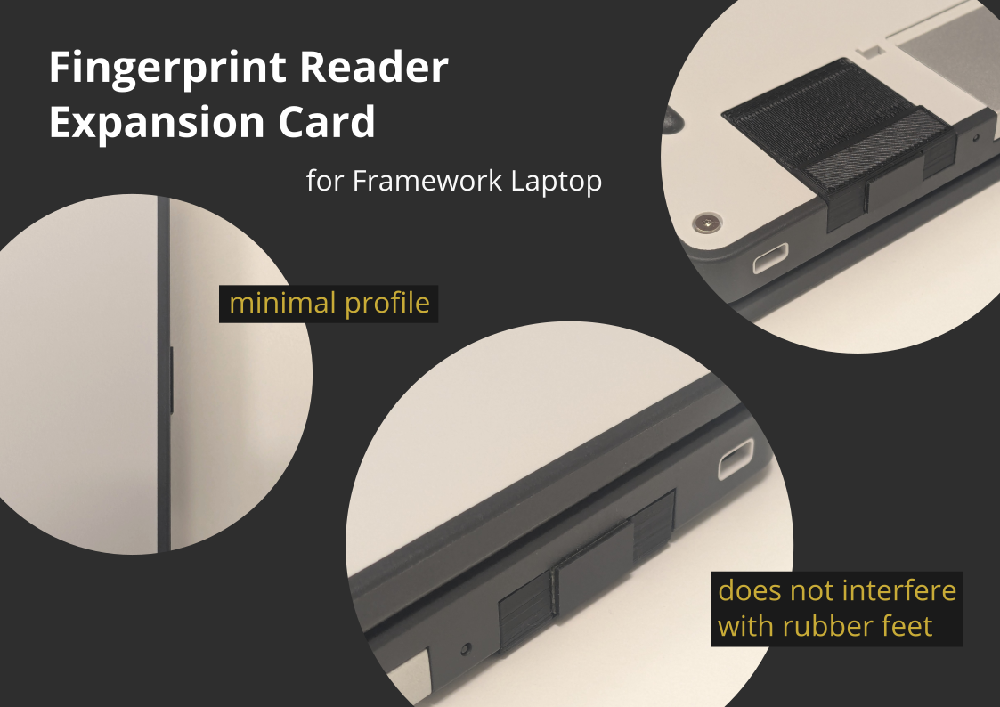

# Fingerprint Reader Expansion Card

The 3D CAD drawing is based on the printable drawing provided by Framework. Here is the finished product after eight iterations:

## Materials

- 3D CAD drawing `ExpansionCard_FingerprintReader.stl`
  - Black PLA (0.2 mm layer, 15% infill)
- Chipsailing CS971 fingerprint reader ([AliExpress](https://aliexpress.com/item/1005008493041334.html))
- USB-A to USB-C adapter ([Ebay](https://www.ebay.com/itm/316027558716))

## Instructions

Remove the external casing from both the fingerprint reader and the USB adapter.
A box cutter and a flat-head screwdriver would suffice. Start from the sides to avoid accidentally damaging any electronic components.

### Getting Expansion Card Enclosures Fabricated

From Framework:

> We've designed the enclosures to be printable on home 3D printers using PLA filament.
>
> If you don't have a 3D printer, it's also easy to order enclosures from the various
> printing services that are out there. Because Expansion Cards are tiny, it is 
> extremely inexpensive to get cards printed. We haven't used all of the services below,
> but these are some of the popular ones:
> - Shapeways (https://www.shapeways.com/) - HP MJF material
> - Hubs (https://www.hubs.com/) - HP MJF material (has a minimum order quantity)
> - Treatstock (https://www.treatstock.com/) - Range of materials, including PLA

### Install the fingerprint reader on Linux

Tested instructions for Fedora 42 can be found here: https://github.com/ddlsmurf/libfprint-CS9711

Resources for other distros: https://gitlab.freedesktop.org/libfprint/libfprint/-/issues/610#note_2357409

## License

Expansion Cards © 2021 by Framework Computer Inc is licensed under CC BY 4.0.

Fingerprint Reader Expansion Card © 2025 by theowoo is licensed under CC BY 4.0.

To view a copy of this license, visit http://creativecommons.org/licenses/by/4.0/
